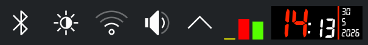

# MagickClock: A KDE Plasma clock widget that uses ImageMagick to render the clock face



## How does it work?

On the beginning of each minute (or second, if seconds are enabled), the widget executes the command line specified in the configuration. The command line should generate an image of the clock and save it to the specified image path. The widget then loads the generated image and displays it as the clock face.

ImageMagick is used by default. But you can use any command line drawing program.

## Installation

```sh
git clone https://github.com/jinliu/plasma-magick-clock.git
cd plasma-magick-clock
kpackagetool6 --type=Plasma/Applet --install src/
```

## Configuration

You can configure the clock by right-clicking on it and selecting "Configure Magick Clock". The configuration dialog allows you to specify the command line to draw the clock, the image path for the clock, and whether to show seconds.

You can use any command line that generates an image of the clock and saves it to the specified image path. To test if your command line works, you can run it in the terminal. Launch bash, set the `IMAGE_PATH` environment variable to a valid path, and run the command line from the configuration. If it generates an image successfully, it should work in the widget as well.

To replicate the screen shot above, install [7-segment font](https://torinak.com/font/7-segment), and add `-font 7-Segment` after `magick` in the command line.
